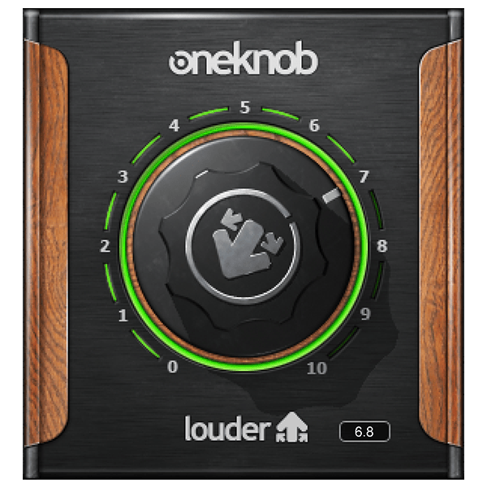

# G3X One Louder

Maximizador de loudness com um macrocontrole, em desenvolvimento com C++20,
JUCE e CMake. A entrega inicial será VST3 64-bit para Windows e Standalone.

**Estado:** M3 — interface em validação. O macrocontrole combina detector RMS, upward
compression, makeup e limiter estéreo linkado com lookahead de 1 ms.

A interface M3 já está em validação, com knob central, ceilings Safe/Hot,
medidores de entrada, lift, limiter e saída, seis presets e indicação de latência.

## Build rápido

```bash
cmake --preset debug
cmake --build --preset debug --parallel 2
ctest --preset debug
```

- [PRD](PRD.md)
- [Referência visual e fontes](docs/references/README.md)
- [Marcos](docs/MILESTONES.md)
- [Validação Windows/FL Studio](docs/M4_WINDOWS_VALIDATION.md)
- [Checklist de release](docs/RELEASE_CHECKLIST.md)



O produto terá algoritmo, identidade, interface, textos e presets originais.

## Licença

Distribuído sob a [licença MIT](LICENSE).
